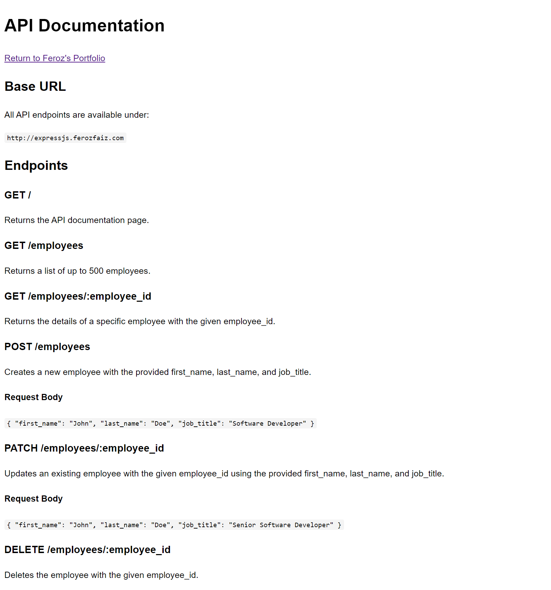

## About the project

This API was built using ExpressJS and utilizes PostgreSQL as its database. It is deployed on a self-managed Kubernetes cluster.

Live Demo: <a href='https://expressjs.ferozfaiz.com/'>expressjs.ferozfaiz.com</a>

### Tech Stack:

- ExpressJS
- PostgreSQL
- Kubernetes
- Docker
- AWS ECR

## Environment

Copy `.env.example` to `.env` and fill in the PostgreSQL values before running the Docker deployment or syncing Cloudflare Worker secrets.

## Cloudflare Containers Deployment

Cloudflare deployment files live in `cloudfare/`. The existing Docker Compose and ECR deployment files are still available for local and future Docker-based use.

Before deploying Cloudflare staging or production, sync the PostgreSQL environment values from the repo `.env` file into Cloudflare Worker secrets:

```bash
cd cloudfare
npm install --no-package-lock
npm run secrets:sync:staging
npm run deploy:staging
```

For production:

```bash
cd cloudfare
npm run secrets:sync:production
npm run deploy:production
```

To verify the secret sync without writing to Cloudflare:

```bash
cd cloudfare
DRY_RUN=true npm run secrets:sync:staging
```

The sync command uploads these secrets for the selected Cloudflare environment:

- `pg_master_host`
- `pg_master_port`
- `pg_master_user`
- `pg_master_password`
- `pg_master_database`

See `cloudfare/README.md` for full Cloudflare command details.

## Screenshots

<br>
<h3 align='center'>Home Page</h3>
<div align='center'>

</div>
